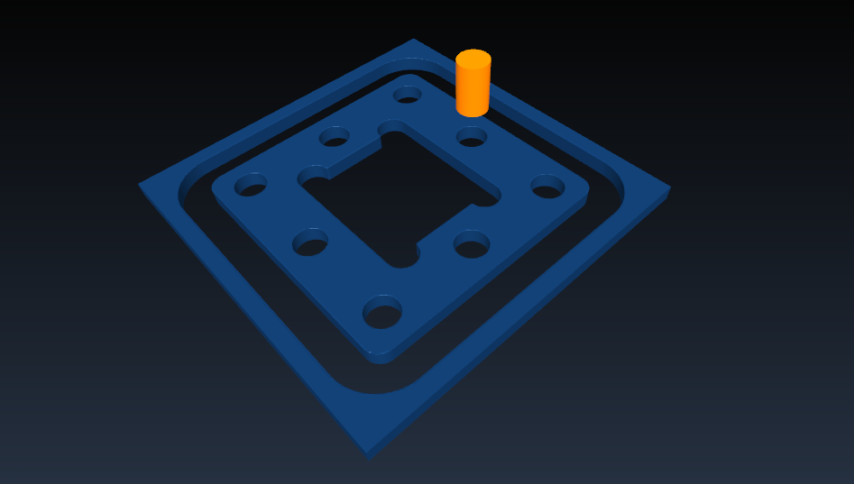

# pycnc

A set of 2.5D CNC Python routines to generate GCode for simple geometries machining on a 3 axis mill or router.

##Getting started

### Install

1. unzip dist/pycnc-0.1.zip (windows) or dist/untar pycnc-0.1.tar.gz (linux)
2. cd into new directory (where setup.py is located)
3. python setup.py install

Copying gcode_generator.py to the same folder as your client scripts is also okay (and simpler) ....

### Use

Please see the examples folder for possible uses. The intended use of pycnc is from another Python script, similar to example_plate.py.

The generated GCode can be visualized and simulated in an open source GCode viewer like [CAMotics](http://camotics.org/download.html)

## Known limitations

pycnc is limited to simple 2.5D shapes. For complex 2D and 3D shapes, [Pycam](http://pycam.sourceforge.net/) is a good free alternative.

## Available GCode generators

To be completed ...

## GCode best practices

[see also](http://linuxcnc.org/docs/html/gcode_overview.html)

- 3 digits after decimal when milling in millimeters, 4 in inches
- consistent white space
- use center-format arcs
- put important modal settings at the top of the file e.g. G17 G20 G40 G49 G54 G80 G90 G94 
- not too many things on a line
- don't set and use a parameter on the same line
- don't use line numbers
- when moving more than one coordinate system, consider inverse time feed mode (G93)
