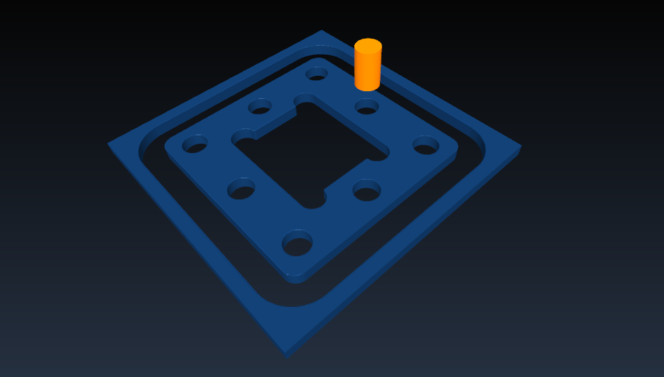

##Getting started

Please see the examples folder for possible uses. The intended use of pycnc is from another Python script, similar to example_plate.py.

The generated GCode can be visualized and simulated in an open source GCode viewer like [CAMotics](http://camotics.org/download.html)

